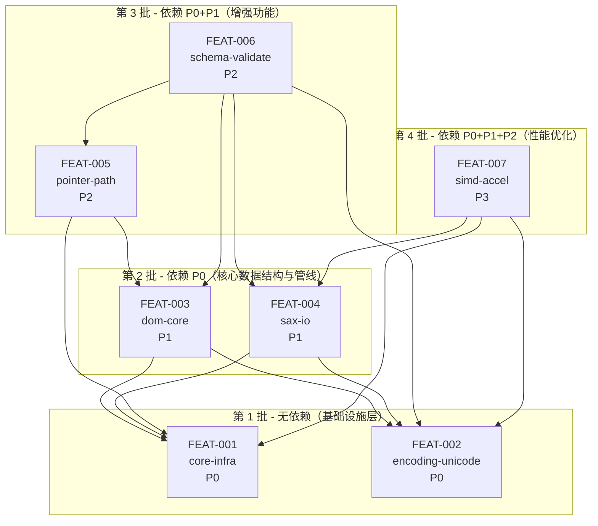

# Feature 拆分方案

**Component ID:** `COMP-001`  
**Component 名称:** `rapidjson-rs`  
**文档版本:** `0.1.0-draft`  
**创建日期:** `2026-05-14`  
**对应 component 设计文档:** [`rapidjson-rs-dev-design.md`](./rapidjson-rs-dev-design.md)

---

## 1. feature 拆分情况

### 1.1 feature 拆分总览

| 统计项 | 数值 |
|--------|------|
| 拆分 feature 数量 | `7` 个 |
| 预估总重构工时 | `中等规模，多迭代交付` 人天 |

> 说明：本次拆分围绕需求文档与 component 级 module 划分，将 `rapidjson-rs` 拆为 7 个可独立重构的 feature，兼顾功能聚合度与依赖有向无环性。

### 1.2 feature 拆分清单

| feature ID | feature 名称 | 功能简要 | 关键接口 | 老代码对应 |
|------------|-------------|----------|----------|------------|
| `FEAT-001` | `core-infra` | 提供 `internal` 工具、错误类型 `error`、基础内存管理 `memory` 与流抽象 `stream` 的核心基础设施，为所有上层 JSON 功能提供通用支撑。 | 内部错误枚举与结果类型；基础分配器接口；流抽象接口（内存/文件/自定义流）。 | `rapidjson_legacy/include/rapidjson/allocators.h`、`stream.h`、`internal/*.h` 等基础设施文件。 |
| `FEAT-002` | `encoding-unicode` | 实现 UTF-8/UTF-16/UTF-32/ASCII 编码支持、自动探测、转码与 Unicode 代理对处理，向解析/生成/DOM 提供统一编码工具。 | 编码探测与解码函数；字符/码点转换接口；编码验证接口。 | `rapidjson_legacy/include/rapidjson/encodings.h`、`unicode.h`，及相关单元测试。 |
| `FEAT-003` | `dom-core` | 实现 JSON DOM 值模型与 Document，包括 7 种 JSON 类型、类型查询、强类型数值 API、对象/数组操作、零拷贝字符串引用、深拷贝与比较等。 | `Value`/`Document` 类型及其 API；基于分配器的节点创建与修改接口。 | `rapidjson_legacy/include/rapidjson/document.h` 及 `test/unittest/documenttest.cpp`、`valuetest.cpp` 等。 |
| `FEAT-004` | `sax-io` | 提供 SAX 解析/生成核心管线，包括 `Reader`/`Writer`、Handler 接口、迭代式解析、多文档流、宽松语法处理等。 | `Reader` 解析入口、Handler 接口；`Writer` 输出接口；流配置与解析模式配置。 | `rapidjson_legacy/include/rapidjson/reader.h`、`writer.h` 及 `test/unittest/readertest.cpp`、`writertest.cpp` 等。 |
| `FEAT-005` | `pointer-path` | 提供 JSON Pointer 功能（解析、内部表示、Get/Set/Create/Erase/Swap），依赖 DOM 结构访问和修改。 | Pointer 解析 API；通过 Pointer 操作 DOM 的接口。 | `rapidjson_legacy/include/rapidjson/pointer.h` 及 `test/unittest/pointertest.cpp`。 |
| `FEAT-006` | `schema-validate` | 实现 JSON Schema 编译与校验逻辑，涵盖 SchemaDocument 构建、Validator、远程引用与错误报告，依赖 DOM、SAX、Pointer、Encoding。 | Schema 解析与编译接口；校验入口（DOM/SAX/输出）；错误报告接口。 | `rapidjson_legacy/include/rapidjson/schema.h`、`schematest.cpp` 等。 |
| `FEAT-007` | `simd-accel` | 提供可选 SIMD 加速点（空白跳过、字符串扫描等），在不引入 crates.io 的前提下，通过编译器内建或手写 intrinsics 提升性能，作为其他 feature 的内部优化选项。 | SIMD 加速的内部函数接口；与 `encoding`/`stream` 相集成的加速入口。 | `rapidjson_legacy/include/rapidjson/internal/ieee754.h`、`simd.h` 及 `test/unittest/simdtest.cpp`、`perftest/rapidjsontest.cpp` 中相关场景。 |

---

## 2. feature 依赖关系有向图

> 依赖说明：
> - `core-infra` 与 `encoding-unicode` 作为基础设施，不依赖其他 feature，是全局底座。
> - `dom-core` 与 `sax-io` 构成 JSON 行为骨架，依赖基础设施但互相之间仅通过清晰 API 协作，不做硬依赖环。
> - `pointer-path` 依赖 DOM 进行路径解析与节点操作，同时依赖基础错误与内存/流设施。
> - `schema-validate` 综合使用 DOM/SAX/Pointer/Encoding，实现复杂校验逻辑，属于高层增强功能。
> - `simd-accel` 作为性能增强层，向 `encoding`/`sax` 等提供可选加速点，但不改变其对外 API，避免将 SIMD 绑定到业务逻辑中。

---

## 3. 开发顺序表

| 优先级 | feature ID | feature 名称 | 前置依赖 | 预估工时 | 重构策略 |
|--------|-----------|-------------|----------|----------|----------|
| P0 | `FEAT-001` | `core-infra` | 无 | 中 | 渐进式重构：先在 Rust 侧用最小实现支撑后续 feature，再逐步对齐 C++ 行为与性能，重视错误模型和内存/流抽象的稳定性。 |
| P0 | `FEAT-002` | `encoding-unicode` | 无 | 中 | 完全 Rust 化：基于需求文档的编码/Unicode 要求设计清晰 API，参考 C++ 算法和测试用例，优先保证正确性和标准合规性。 |
| P1 | `FEAT-003` | `dom-core` | `FEAT-001`, `FEAT-002` | 高 | 渐进式重构：以 `Value`/`Document` 为中心，按照 C++ 行为与 gtest 用例逐步实现，先覆盖常用类型和操作，再补齐边界场景与性能优化。 |
| P1 | `FEAT-004` | `sax-io` | `FEAT-001`, `FEAT-002` | 高 | 混合模式起步：先实现与 C++ Reader/Writer 等价的核心事件流与 Handler 接口，再按测试用例支持宽松语法、迭代式解析、多文档流等扩展路径。 |
| P2 | `FEAT-005` | `pointer-path` | `FEAT-003`, `FEAT-001` | 中 | 完全 Rust 化：在 DOM 行为稳定后，实现 Pointer 解析与操作，严格对照 C++ 行为和 pointer 测试；注意错误报告和路径边界用例。 |
| P2 | `FEAT-006` | `schema-validate` | `FEAT-003`, `FEAT-004`, `FEAT-002`, `FEAT-005` | 高 | 高风险模块采用渐进式重构：先实现核心 Draft v4 子集，逐步扩展到全部规则，过程中持续对照 C++ schematest 用例和性能基准。 |
| P3 | `FEAT-007` | `simd-accel` | `FEAT-001`, `FEAT-002`, `FEAT-004` | 中 | 性能优化后置：在功能与正确性稳定后，为空白跳过、字符串扫描等热点路径设计可选 SIMD 版本，通过特性或策略对象注入，不改变公开 API 和语义。 |

> 重构策略总结：
> - 基础设施与编码模块（P0）优先完全 Rust 化，确保后续功能有稳定底座。
> - DOM 与 SAX（P1）采用渐进式重构，始终由 Legacy gtest 校验行为；必要时可在早期阶段通过临时适配层重用 C++ 实现，以降低风险。
> - Pointer 与 Schema（P2）建立在 P1 基础上，优先确保行为和错误报告与 C++ 一致，再逐步增强可维护性与性能。
> - SIMD 加速（P3）在功能完备后再引入，避免在行为尚未稳定时引入额外复杂度。

---

## 4. 商用问询记录与依赖策略继承

> 以下内容直接继承自 component 级开发/测试设计文档，在后续所有 feature 级开发设计文档与测试设计文档中必须保持一致。

| 字段 | 内容 |
|------|------|
| 是否商用代码 | `是` |
| 允许依赖范围 | `core/std-only`（禁止 crates.io 第三方依赖） |
| crates.io 使用策略 | 核心 crate `rapidjson-rs` 不得引入任何 crates.io 依赖；如需 SIMD/测试相关能力，应优先使用 Rust 标准工具链或 C/C++ 侧能力，而不是第三方 Rust crate。 |

**对 feature 级的影响：**
- 所有 feature 级实现（包括测试）仅允许依赖 `core` 与 `std`，不得引入任何 crates.io 第三方 crate。
- 需要的辅助能力（如基线差异比对、数据生成、正则/模式匹配）应通过自研实现或复用 C/C++ 侧逻辑完成，禁止在 feature 级设计中添加第三方 Rust 依赖。
- 性能优化（如 SIMD）必须基于编译器内建/平台 intrinsic，不得通过 crates.io SIMD 库实现。

---

## 5. 人工确认说明

- 本文档为 `COMP-001 / rapidjson-rs` 的 feature 拆分方案，后续所有 feature 级开发/测试设计文档将严格遵循本方案中的 feature 列表、依赖关系与开发顺序。
- 若需调整 feature 划分（新增/合并/拆分）、依赖关系或优先级，请通过以下方式反馈：
  - 直接在评审中给出文字意见，指明要调整的 `feature ID` 和预期变更；或
  - 在 `{output_path}/{component_id}/split_feedback.yaml`（本仓库中对应为 `docs/COMP-001/split_feedback.yaml`）中按模板填写 `feat_adjustments` / `dependency_adjustments` / `priority_adjustments` 字段。
- 只有在本拆分方案被人工批准后，才会开始逐个 feature 生成一对详细的开发设计文档与测试设计文档。
